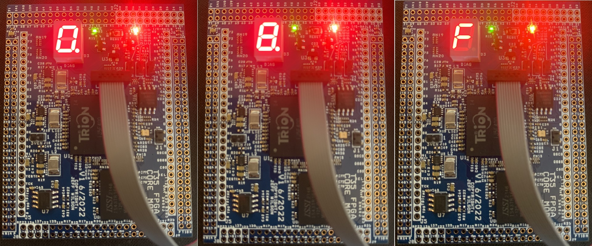

# T35seg7 #
## Project Overview ##

This is a project for the [S100Computers]([http://www.google.fr/](http://s100computers.com/) "S100 Computers") T35 FPGA Module.  
It is intended as a proof-of-life test for the module that does not impact on existing S100Computers designs.
It will not impact future designs that use the expanded I/O capabilities if pins 1 through 8 of the J5 header
are left unconnected (see fpga_coret35 schematic).  All other pins are in a tri-state mode and will not affect
any current (as of October 2022) S100Computers designs that use the previous Intel/Altera FPGA Module footprint.

Once compiled and programmed, the T35seg7 project will drive the on-board seven segment LED display with a
number sequence ranging from 0 to hexadecimal F on one-second intervals while flashing the decimal point on 1/2
second intervals (500mS).  

## Cloning/Downloading ##

## Compiling ##

## Programming ##

